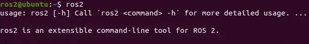
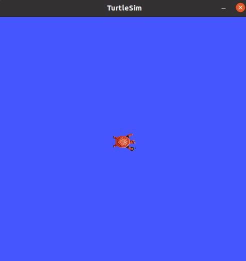
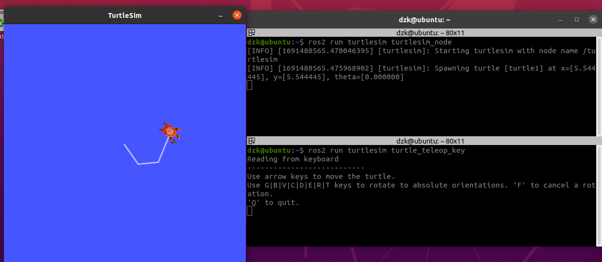

***2023.8.8***

### 一、环境配置

ubuntu 20.04 +ROS2+gazebo11+python3.8 +gcc/g++ 7.5.0+anaconda 5.3.1 +open3d 0.9.0

1.安装ubuntu 20.04 

虚拟机VMware Workstation 16 pro +ubuntu 20.04镜像

该部分网上教程有很多，非常容易，不再详谈。

系统镜像下载链接：https://pan.baidu.com/s/1TggeQ4N_e1QneFJhszoVlg 密码：1122

2.ROS2 安装

这里建议直接采用鱼香ROS的一键安装

首先启动虚拟机或者启动双系统中的ubuntu，打开终端，输入下面的指令。

```shell
wget http://fishros.com/install -O fishros && . fishros
```

输入密码，在选项界面选择1-一键安装ROS，接着根据你的情况选择是否更换系统源，接着等待一会就会让你选择要安装的ROS2版本了。这里选择foxy版本的ROS2即可。接着会问你安装桌面版还是基础版，我们选择桌面版，包含可视化工具，如果是在树莓派上装可以使用基础版。

安装完成后输入ros2如果看到下面的界面则安装成功



安装turtlesim测试

```shell
sudo apt update
sudo apt install ros-foxy-turtlesim
ros2 run turtlesim turtlesim_node
```

应该出现一个模拟器窗口，中间有一只随机的乌龟。



打开一个新的终端用节点控制运行一个新节点来控制第一个节点中的海龟:

```shell
ros2 run turtlesim turtle_teleop_key
```



至此，ROS2安装完毕。

3.gazebo11安装

因为安装ROS2不会默认安装gazebo，所以我们要手动安装,一行命令很简单，如果提示找不到先去更新下ROS2的源。

```
sudo apt install gazebo11
```

两轮差速demo测试

```shell
sudo apt install ros-foxy-gazebo-*
```

```shell
gazebo /opt/ros/foxy/share/gazebo_plugins/worlds/gazebo_ros_diff_drive_demo.world 
```


然后新开一个终端运行其中一个示例命令，例如：

```shell
ros2 topic pub /demo/cmd_demo geometry_msgs/Twist '{linear: {x: 1.0}}' -1
```

这样就会看到该汽车正在向前移动。

4.安装anaconda 5.3.1

下载完安装包后放入主目录，终端：

```shell
bash Anaconda3-5.3.1-Linux-x86_64.sh
```

按提示操作，在.bashrc文件里面输入anconda的bin目录路径：

```shell
export PATH=“/home/用户名/anaconda3/bin:$PATH”
```

检查是否安装成功：

```shell
conda --version
```

在.bashrc中最后添加以下（用户名或者以实际路径为准）：

```
# >>> conda initialize >>>
# !! Contents within this block are managed by 'conda init' !!
__conda_setup="$('/home/用户名/anaconda3/bin/conda' 'shell.bash' 'hook' 2> /dev/null)"
if [ $? -eq 0 ]; then
    eval "$__conda_setup"
else
    if [ -f "/home/用户名/anaconda3/etc/profile.d/conda.sh" ]; then
        . "/home/用户名/anaconda3/etc/profile.d/conda.sh"
    else
        export PATH="/home/用户名/anaconda3/bin:$PATH"
    fi
fi
unset __conda_setup
conda deactivate
# <<< conda initialize <<<
```

激活conda环境：

```
conda activate
```

创建新的pytorch环境：

```shell
conda create -n pytorch python==3.8
```

安装pytorch环境，一键安装：

```shell
pip install torch==1.11.0+cu113 torchvision==0.12.0+cu113 torchaudio==0.11.0 --extra-index-url https://download.pytorch.org/whl/cu113
```

安装完成后测试：

```
conda activate pytorch
python
import torch
x = torch.rand(5,3)
print(x)
```

